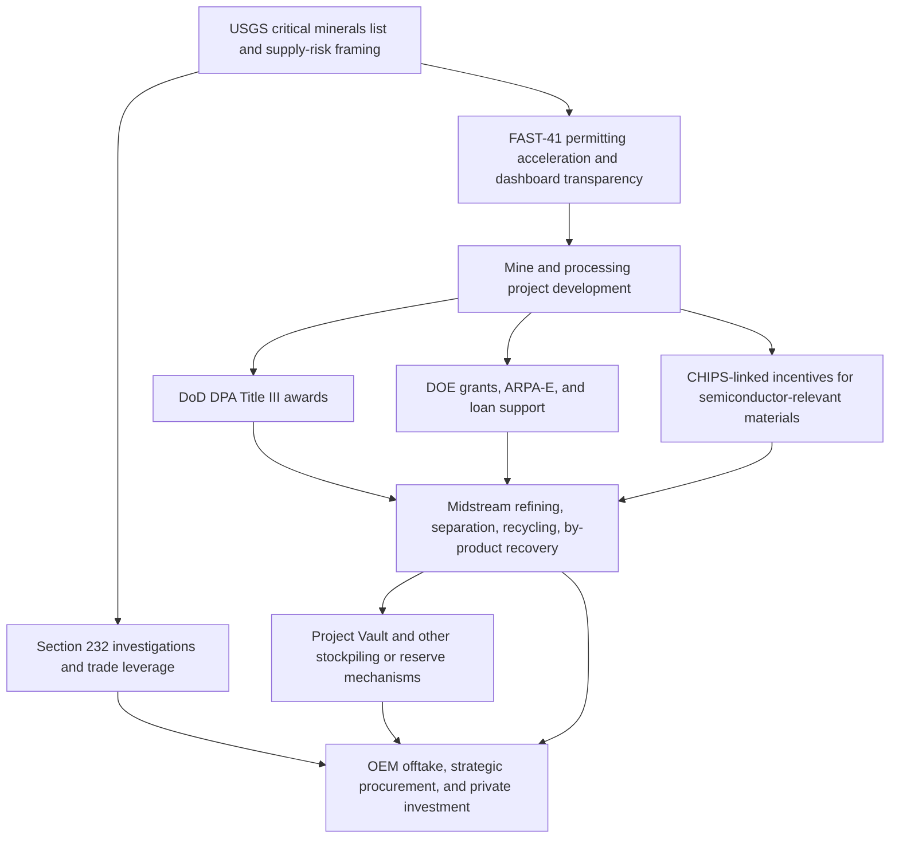
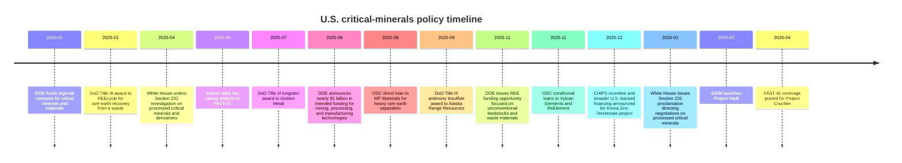

# U.S. Critical-Minerals Industrial Policy Briefing

## Executive summary

The U.S. critical-minerals push is no longer just about opening mines. It is now a layered industrial-policy stack that reaches from upstream permitting to midstream refining, recycling, stockpiling, project finance, trade remedies, and tax incentives. The center of gravity has moved toward **processing capacity, by-product recovery, and supply-chain control**, because that is where the U.S. remains structurally weakest and where dependence on foreign refining is still highest. Official actions since 2025 show a clear pattern: accelerate permits, crowd in private capital, support conversion and refining, and keep trade tools in reserve if market outcomes still favor foreign-dominated supply chains. citeturn28view2turn15view0turn25view5turn10view0turn34view0

Project Crucible is the clearest current signal. It is a proposed integrated non-ferrous smelting and refining complex in entity["city","Clarksville","tennessee, us"], entity["state","Tennessee","us state"], backed by entity["company","Korea Zinc","south korean smelter"] and multiple U.S. policy tools. Public documents point to roughly **$6.6 billion of capex and about $7.4 billion total investment including financing costs**, a **540,000-ton-per-year** product slate centered on zinc, lead, copper, precious metals, and several strategic by-products such as antimony, indium, gallium, and germanium, plus sulfuric acid and semiconductor-grade sulfuric acid. Just as important, the project is designed around recovery from complex feedstocks, residues, and the legacy Nyrstar site, which is exactly the kind of midstream and by-product play Washington has been missing. citeturn4view0turn30view0turn6view0turn7view0turn7view1turn43search9

Project Vault is the other major shift. Officially, it is an independently governed public-private partnership backed by a **$10 billion** direct loan from the entity["organization","Export-Import Bank of the United States","us export credit agency"] and nearly **$2 billion** in private capital, designed to create a U.S. Strategic Critical Minerals Reserve for industrial users rather than only for narrow defense contingencies. What is public from official releases is the broad structure and participating OEMs and traders. What is still not fully public is the precise inventory mix, the detailed pricing formula, and the exact drawdown mechanics. Recent reporting suggests a 60-day emergency-supply ambition, membership fees, and emergency-access arrangements, but those details remain only partly documented in public primary sources. citeturn10view0turn10view1turn10view2turn13search1turn13search8turn13news40turn13news43

For a UK-based metals analyst, the big takeaway is simple: the U.S. is now trying to build **midstream optionality** with the same seriousness it once reserved for upstream mine announcements. That matters for spreads, not just outright commodity prices. It favors assets and companies tied to **complex concentrates, secondary feedstocks, e-waste, pond-cake recovery, and “minor” metals embedded in major-metal systems**. In other words, gallium, germanium, indium, bismuth, tellurium, cadmium, and antimony are increasingly being treated as strategic co-products rather than incidental recovery credits. citeturn7view1turn7view2turn25view2turn34view2turn34view3

## What the U.S. policy stack now looks like

In practical terms, the U.S. stack now has six linked layers: designation of strategic minerals and import-risk assessments, permitting acceleration, direct grants and loans for processing and recycling, tax incentives for domestic production and factory build-out, stockpiling and reserve mechanisms, and trade measures that can be activated if market outcomes still fail to support domestic or allied supply. The U.S. is not using every lever equally aggressively in every commodity, but the architecture is now visible. citeturn28view2turn15view0turn25view5turn10view0turn34view0turn40search0turn40search1

The schematic below is a practical way to think about that stack.

That picture is drawn from the White House Section 232 actions, the FAST-41 fact sheet and annual report, the EXIM Project Vault release, DOE funding announcements, and IRS and DOE tax-credit guidance. citeturn28view2turn15view0turn16search0turn10view0turn34view0turn40search0turn40search1

The timeline below captures the highest-value federal actions from 2025 into 2026.

Each of those milestones is individually documented in official releases or dashboards, and together they show the same policy logic: de-risk conversion and refining capacity first, then use reserves and trade policy to stabilize the market if needed. citeturn34view3turn25view2turn28view2turn15view2turn25view0turn34view0turn25view3turn25view1turn34view2turn25view4turn29search2turn28view0turn10view0turn43search0

## Project Crucible

Project Crucible is the sharpest current example of U.S. interest in rebuilding large-scale non-ferrous midstream capacity. The federal FAST-41 dashboard shows that the project was posted on **April 22, 2026**, is in **planned** status, has **no federal permitting processes yet listed**, and has an **estimated project cost of $6.6 billion**. The dashboard describes it as an integrated non-ferrous smelting and refining facility intended to produce 12 types of non-ferrous metals, including 11 of the 60 critical minerals designated by the U.S. government, plus semiconductor-grade sulfuric acid, and identifies the project as adjacent to Nyrstar’s existing smelting site in Clarksville. citeturn4view0turn43search1

The FAST-41 press release two days later adds the most useful official interpretive detail. It says Project Crucible is the **first project listed** after the state-federal memorandum with Tennessee, that it would become the **first large-scale U.S.-based zinc refinery built since the 1970s** once permitted, and that the facility is intended to produce 12 types of non-ferrous metals including zinc, lead, copper, gold, antimony, gallium, and germanium, with design based on Korea Zinc’s Onsan smelter in South Korea. citeturn43search0

The financing package is substantial but the public breakdown is not perfectly uniform across sources. Korea Zinc’s December 2025 release describes a project with **$6.6 billion capex and $7.4 billion total planned investment**, says approximately **$2.15 billion** arranged by the U.S. defense side and investors would be put into construction, and says the U.S. defense side’s **conditional investment is $1.4 billion**. Korea Zinc’s investor presentation, by contrast, shows a structure with **$1.94 billion foreign-JV equity, $0.58 billion Korea Zinc equity, $4.7 billion of borrowings, and a $0.21 billion CHIPS grant**. Reuters separately reported that a U.S. government-led joint venture would buy roughly **$1.9 billion** of new Korea Zinc shares and obtain about a **10% stake** in the parent. The safe reading is that the overall financing concept is clear, but the public materials treat capex, working capital, financing costs, and parent-level equity mechanics somewhat differently. citeturn30view0turn6view0turn7view0turn31news40turn31news41turn31news43

On timing, the official and company materials are broadly aligned. The investor deck shows site preparation starting in **2026**, groundbreaking in **early 2027**, utility commissioning in **late 2028**, zinc commissioning in **early 2029**, lead in **third quarter 2029**, copper in **fourth quarter 2029**, and full utilization by **first quarter 2030**. Korea Zinc’s public release likewise says site preparation begins in 2026, full-scale construction starts in 2027, and phased commercial operations begin in 2029. Recent local and trade reporting says the same in plainer language and suggests around 33 months of build time. citeturn7view0turn30view0turn31search2turn43search4

The product slate is what makes the project strategically interesting. Korea Zinc says the plant will process around **1.1 million tons** of raw materials annually and produce around **540,000 tons** of finished products, including zinc, lead, copper, gold, silver, antimony, indium, bismuth, tellurium, cadmium, palladium, gallium, germanium, sulfuric acid, and semiconductor-grade sulfuric acid. Trade reporting provides more granular volume guidance of around **300,000 tons of zinc, 200,000 tons of lead, 35,000 tons of copper, and 5,100 tons of rare and strategic metals**. The dashboard’s “12 types” and the company’s “13 nonferrous metals” wording are not perfectly consistent, but the mismatch appears to come from different counting conventions for sulfuric-acid outputs and grouped by-products rather than a change in substance. citeturn30view0turn43search7turn43search9turn4view0

Technologically, the official public message is less about named vendors and more about platform replication. The project is explicitly described as based on Korea Zinc’s Onsan model. The investor deck says that means an integrated zinc-lead-copper system, proprietary rare-metal recovery, and recovery rates up to roughly **96.5%**, including the ability to recover value from complex feedstock, scrap, spent batteries, e-waste, and particularly metals trapped in legacy “pond cake” at the Nyrstar site. That residue angle matters. It means Project Crucible is not just a new smelter. It is also a **by-product and residues recovery platform** sitting on top of an old U.S. smelting footprint. As of April 2026, however, no EPC contractor or technology partner list appears in the public official materials; trade reporting says EPC contractor selection was still expected during 2026. citeturn7view1turn7view2turn30view0turn31search5

On permitting and environment, the public file is still early-stage. The FAST-41 dashboard shows the project as planned, with no listed federal review processes and no estimated completion date yet posted. The Permitting Council says the Tennessee state-federal MOU should improve coordination and transparency, but the actual permit inventory has not yet been published on the federal page. One useful but limited additional datapoint is that Tennessee’s site viewer shows the existing site with NPDES records, including a final NPDES permit dated March 9, 2026, which suggests ongoing environmental permitting activity at the legacy facility. What it does **not** yet prove is the full permit stack for the new Project Crucible build-out. That is still a real public-information gap. citeturn43search1turn43search0turn43search2

The CHIPS linkage is also important. The U.S. Commerce-side announcement said the project would receive **$210 million** in CHIPS incentives because the relevant minerals and chemicals are essential to the semiconductor supply chain, especially for silicon and compound-semiconductor manufacturing. That is unusual and revealing. It shows Washington is willing to treat some mineral-processing projects not as mining policy, but as **semiconductor industrial strategy** when the outputs are things like gallium, germanium, and ultra-high-purity sulfuric acid. citeturn29search2turn30view0turn7view0

## Project Vault

Project Vault is the clearest sign that Washington is trying to move from ad hoc support into a more permanent **demand-side and buffer-stock model**. EXIM’s February 2, 2026 release says the bank approved a **direct loan of up to $10 billion** to Project Vault, establishing the U.S. Strategic Critical Minerals Reserve as an **independently governed public-private partnership** that will store essential raw materials in secure facilities across the United States. EXIM also says the partnership includes original-equipment manufacturers and private capital providers, with initial participation signaled by Clarios, GE Vernova, Western Digital, Boeing, and others, alongside trading and supply firms such as Hartree, Mercuria, and Traxys. citeturn10view0turn10view1

The official description is intentionally high level. EXIM’s subsequent testimony frames Project Vault as a market-driven tool designed to help American manufacturers absorb supply shocks without taxpayer exposure and says it is aimed at solving broader market weaknesses, not just building a passive stockpile. Reuters’ latest April 2026 update reinforces that point, quoting EXIM’s chairman saying the vehicle was designed to address weak capital availability, the lack of large creditworthy counterparties, and the need for more flexible structures that can support processing and long-term supply commitments. That makes Vault look less like a conventional reserve and more like a hybrid between a reserve, a financing platform, and a coordinated procurement vehicle. citeturn10view2turn10view3turn13search1

On structure and timing, the best-supported public reading is this: formal launch came on **February 2, 2026**; the capital stack is **$10 billion EXIM debt plus roughly $2 billion private capital**; governance is through an **independent entity**; and as of **April 20, 2026**, officials said the first funding tranche was close to being finalized. Official sources do not yet publish a detailed public term sheet, board composition, storage locations, or a commodity-by-commodity inventory plan. citeturn10view0turn10view1turn13search1

The intended inventory and access rules are where the data gaps are largest. Official EXIM documents refer only to “essential raw materials.” Media reporting fills in more detail, but it should be treated as provisional until primary documents catch up. Reuters, the Financial Times, and the Associated Press have reported that Vault is intended to cover a broad range of critical minerals, with examples including rare earths, copper, and lithium; that it may target up to a **60-day emergency supply**; and that participating manufacturers may pay fees for emergency access while trading firms receive commissions for procurement and logistics. Those reports are plausible and internally consistent, but as of now the U.S. government has not published the full public operating rules. citeturn13search8turn13news40turn13news43

That matters for investors and analysts because the commercial effect depends on implementation. If Vault becomes a genuine buyer or holder of last resort during shocks, it can smooth volatility and support credit formation for new processing projects. If it remains mostly an emergency reserve, its market effect will be narrower. Either way, it is already a strong signal that Washington sees mineral security as a **working-capital and market-structure problem**, not only a geology problem. citeturn10view0turn13search1turn13news40

## Permitting, DPA, and trade measures

### FAST-41 and the Permitting Dashboard

The FAST-41 mechanism matters because it turns “we support this project” into a specific procedural discipline. The Permitting Council’s current fact sheet says a covered project gets a dedicated project advisor, a coordinated project plan within **60 days** of dashboard posting, a comprehensive public permitting timetable, public posting of project information and public-meeting details, and formal accountability if agencies miss milestones. Agencies that fail to hit posted completion dates go into **nonconformance**, must provide additional reporting, and those failures are reported to Congress. citeturn15view0

That does not mean FAST-41 overrides environmental law or guarantees an approval. Interior’s April 2025 mining-project announcement is explicit that FAST-41 does **not** change statutory or regulatory requirements and does not predetermine the outcome of federal decision making. What it does do is force sequencing, interagency coordination, and transparency. That may sound bureaucratic, but for mineral projects it directly affects financing because it reduces schedule ambiguity. citeturn15view2

The program also has real scale now. The Permitting Council’s FY2025 annual report says there were **85 active projects** in the FAST-41 program, with **62 new projects** added in FY2025, including **42 mining projects**, and that the active portfolio more than doubled year on year. Ten FAST-41 projects completed environmental review and permitting in FY2025, including four mining projects. In other words, FAST-41 is no longer a niche process. It is becoming part of the default federal infrastructure toolkit for mining and now processing as well. citeturn16search0

### Defense Production Act Title III

The DPA Title III program remains one of the most important de-risking tools for critical minerals, especially where projects are too early, too strategic, or too operationally awkward for conventional capital to fund cleanly. The DoD budget justification says Title III authorizes economic incentives to **create, maintain, protect, expand, or restore domestic sources** for critical components, critical technology items, and industrial resources. The FY2026 request included **$236.923 million** of discretionary funding plus **$29 million** of mandatory reconciliation funding, with the mandatory portion specifically intended to establish strategic and critical minerals and materials sources. citeturn25view5turn26search0

The recent award pattern is especially revealing. In January 2025 the U.S. defense side awarded **$5.1 million** to REEcycle to restart a demonstration facility and commission a commercial facility expected to produce **50 tons per year** of rare-earth oxides from recycled electronic waste. In July 2025 it awarded **$6.2 million** to Golden Metal Resources for pre-feasibility, metallurgy, environmental studies, and technical work at the Pilot Mountain tungsten project in Nevada. In September 2025 it awarded **$43.4 million** to Alaska Range Resources to extract, concentrate, and refine stibnite into military-grade antimony trisulfide. That mix shows Title III is being used not only for mining, but also for **waste recovery, technical de-risking, processing, and derivative-product capability**. citeturn25view2turn25view0turn25view1

For private investors, the implication is that Title III is most valuable where a project solves a defense-relevant gap that markets are not fully pricing. It can lower early-stage technical risk, make bank conversations easier, and signal federal priority. But the flipside is that projects supported this way are more likely to be shaped by national-security priorities, product qualification requirements, and procurement logic rather than only by near-term spot economics. That is especially true when Title III is combined with adjacent defense-side loan tools such as the Office of Strategic Capital. citeturn25view5turn25view3turn25view4

### Section 232 and other trade measures

On trade, the U.S. has clearly built leverage but has not yet fully fired it in processed critical minerals. The April 15, 2025 White House order launched a Section 232 investigation into imports of processed critical minerals and their derivative products, defining the scope broadly enough to include not only processed materials such as oxides, salts, metals, powders, and master alloys, but also derivative goods such as semiconductor wafers, anodes, cathodes, permanent magnets, motors, batteries, microprocessors, radar systems, wind-turbine components, and advanced optical devices. BIS lists the investigation as initiated on **April 22, 2025**. citeturn28view2turn38search1

The January 14, 2026 proclamation did **not** impose a blanket tariff. Instead, it directed negotiations with trading partners and explicitly said that if negotiations fail or prove ineffective, the President may consider other remedies, including **minimum import prices** for specific categories of critical minerals. Because the proclamation references the 180-day Section 232 timeline, the most important immediate watchpoint is whether those negotiations produce agreements or whether the U.S. turns to tariffs or price-based border measures by mid-2026. citeturn28view0turn28view1

Recent reporting suggests the administration is still testing models rather than locking one in. Reuters reported in April 2026 that USTR was pressing allies to accept a “national security premium” for non-Chinese critical minerals. Earlier Reuters reporting also described discussion of a trade bloc and price-floor concepts, then a partial retreat from explicit government-guaranteed mineral price floors. The picture, in other words, is not policy chaos so much as **policy experimentation**. The direction is clear, but the exact border mechanism is still unsettled. citeturn27news19turn27news21turn27news22

One related but more indirect trade datapoint is the April 2026 proclamation modifying Section 232 actions on steel, aluminum, and copper derivative products. That change narrowed duty exposure for products with low metal content, showing that the White House is willing to adjust metal-related Section 232 measures in fairly operational ways once downstream distortion becomes too broad. That precedent matters for critical minerals because it suggests any future 232 remedy could also become more tailored over time. citeturn28view3turn27search1

## Other programs and UK/European parallels

Outside the headline items, several other U.S. tools now matter materially for midstream processing and by-product recovery.

The first is CHIPS-related support. The Korea Zinc award shows the U.S. government is willing to frame some mineral-processing capacity as a semiconductor chokepoint issue. That is strategically important because it broadens the coalition behind funding. Gallium, germanium, and ultra-pure sulfuric acid can now sit inside a semiconductor-industrial-policy lane, not only a mining lane. citeturn29search2turn30view0

The second is DOE. In August 2025 DOE announced nearly **$1 billion** in intended funding across key stages of critical-minerals and materials supply chains. Notably, the proposed Critical Minerals and Materials Accelerator included by-product and scrap separation, as well as refining and alloying of gallium, gallium nitride, germanium, and silicon carbide for semiconductor uses. DOE then followed with a **$134 million** rare-earth funding opportunity in December 2025 focused on unconventional feedstocks such as mine tailings and e-waste, and earlier with **$45 million** for regional consortia built around secondary and unconventional feedstocks such as coal by-products, oil-and-gas effluent waters, and acid mine drainage. ARPA-E separately announced nearly **$25 million** for technologies to extract critical minerals from wastewater. The through-line is obvious: Washington is trying to turn waste streams and industrial residues into commercial feedstock. citeturn34view0turn34view2turn34view3turn36search0turn36search1

The third is the U.S. defense-credit complex around the Office of Strategic Capital. That office has already made a **$150 million** direct loan to MP Materials for heavy rare-earth separation in California and announced **$700 million** of conditional loan commitments to Vulcan Elements and ReElement for rare-earth separation, metallization, and magnet manufacturing. In effect, this is a bridge between DPA-style strategic prioritization and conventional project finance. It is especially powerful for midstream because it supports processing nodes that are too capital intensive for venture funding and too policy-sensitive for ordinary lenders to price comfortably. citeturn25view3turn25view4

The fourth is tax and state support. IRS guidance pages show the Section 45X advanced manufacturing production credit remains live for applicable critical minerals, while DOE’s 48C program continues to support advanced-energy manufacturing projects, with roughly **$10 billion** in allocations made across two rounds to about **250 projects** in more than 40 states. At the state level, Tennessee’s public funding-board materials show a **$45 million FastTrack Economic Development Grant** for Korea Zinc and Crucible Metals. These are not the headline national-security instruments, but they matter because they improve project economics and location competitiveness around the edges. citeturn40search0turn40search8turn40search1turn40search5turn8search5

The fifth is the longstanding public-stockpile backbone. The Defense Logistics Agency’s Strategic Materials arm still manages the National Defense Stockpile and explicitly describes itself as the leading U.S. agency for analysis, planning, procurement, and management of materials critical to national security. DLA has also expanded strategic-materials R&D and recovery-oriented programs. The analytical distinction is useful: the National Defense Stockpile is a **defense stockpile**, while Project Vault is trying to become a **civilian-industrial reserve and market-stabilization platform**. citeturn37search0turn37search1turn37search6turn37search15

On UK and European parallels, the comparison is straightforward. The entity["country","United Kingdom","sovereign state"] is now leaning more explicitly into **midstream processing and recycling**. Its new strategy, “Vision 2035,” says the country will try to use its competitive advantage in recycling and innovative midstream processing, with a stated ambition to produce **10%** of its needs domestically and **20%** through recycling by 2035, backed by up to **£50 million** for UK businesses. The EU’s Critical Raw Materials Act, meanwhile, is building a strategic-project and diversification framework focused on extraction, processing, recycling, and third-country supply diversification rather than borrowing heavily from the U.S. playbook of stockpiles plus direct loans plus trade threats. citeturn39search3turn39search7turn39search15turn39search1turn39search5turn39search9turn39search13

The basic contrast is that the U.S. approach is more comfortable with **hard industrial policy**. The UK and EU are clearly moving in the same direction on recycling, strategic projects, and supply diversification, but the U.S. is going further on direct project finance, reserve creation, and potential border remedies. citeturn10view0turn25view3turn28view0turn39search3turn39search13

## Implications for a UK metals analyst

The first implication is for pricing. This stack is more likely to affect **premia, basis, and volatility dampening** than headline LME-style benchmark prices in the near term. Project Vault, if it becomes operational at scale, could soften panic spikes for selected materials by improving access and inventory coverage. Section 232 action, if it moves from negotiation to tariffs or minimum import prices, could do the opposite for specific import-dependent materials or derivatives. That means watching policy-sensitive premia in antimony, gallium, germanium, indium, and magnet-linked rare earths may matter more than watching only broad base-metal benchmarks. citeturn10view0turn13search1turn28view0turn27news19

The second implication is for project selection and valuation. By-product recovery has moved from “nice upside” to “strategic core.” Crucible’s own investor materials emphasize recovery from pond cake and complex feedstocks. DOE and ARPA-E are explicitly funding unconventional feedstocks, residues, and waste streams. The defense side is funding e-waste recovery as well as antimony and tungsten. For analysts, that argues for giving more weight to flowsheets, impurity tolerance, recovery rates, residue-handling capability, and end-product purity than to simple ore-grade narratives. citeturn7view1turn7view2turn25view2turn34view0turn34view2turn34view3

The third implication is that midstream is finally getting real capital signals. For years, western critical-minerals policy talked about mines while leaving refining and conversion undercapitalized. That is changing. Korea Zinc, MP Materials, Vulcan/ReElement, REEcycle, and Project Vault together show a policy preference for projects that close the gap between raw material and manufacturing-grade products. In market terms, the U.S. is trying to buy down the “conversion bottleneck” risk premium. citeturn30view0turn25view3turn25view4turn25view2turn10view0

The fourth implication is policy risk. The U.S. stack is getting stronger, but it is not yet fully coherent. Public financing terms remain partly opaque, Project Vault’s operating mechanics are still incompletely disclosed, and the Section 232 endgame is unresolved. In addition, some public figures differ across company releases, investor decks, and press reporting because some sources count capex only while others include financing costs, working capital, or parent-company equity mechanics. That does not negate the policy direction, but it does mean analysts should be careful about treating every announced dollar as equivalent. citeturn30view0turn6view0turn31news43turn10view0turn13news40turn28view0

A practical monitoring checklist is below.

- Watch the Project Crucible FAST-41 page for the first posted **Coordinated Project Plan**, permit inventory, milestone dates, and any shift from “planned” to active permit processes. citeturn43search1turn15view0
- Watch EXIM and major newswires for Project Vault’s **first funding tranche**, public governance details, and any published access rules or inventory categories. citeturn10view0turn13search1
- Watch the White House and BIS for the Section 232 **processed critical minerals** negotiation outcome, especially before the 180-day window closes. citeturn28view0turn38search1
- Track DOE and defense-side awards for projects involving **waste streams, residues, by-products, magnet metals, and semiconductor-linked minor metals**. citeturn34view0turn34view2turn25view2turn25view1turn25view0
- Keep an eye on USGS commodity updates and market reports for **import reliance, supply concentration, and by-product-sensitive pricing**. The IEA’s 2025 outlook is still the best concise global framing document, especially on supply concentration and copper risk. citeturn41search1turn41search9turn41news39

### Open questions and limitations

A few points are still not fully public. Project Crucible’s full federal and state permit inventory is not yet posted. Public disclosures do not yet name final EPC or technology partners for the Tennessee build-out. Project Vault’s detailed inventory rules, pricing mechanics, drawdown triggers, and membership terms remain only partly visible in public primary documents. And on Section 232, the administration has shown the direction of travel, but not yet the final instrument. Those are the main gaps that matter most for serious market analysis. citeturn43search1turn31search5turn10view0turn13news40turn28view0

## Source table and latest reports

| Topic | Primary links | Recent analysis links | Why it matters |
|---|---|---|---|
| Project Crucible federal status | Permitting Dashboard and FAST-41 release citeturn43search1turn43search0 | Reuters and trade coverage citeturn43search9turn43search7 | Best source for current federal status, timing, and the fact that the public permit inventory is still not posted |
| Project Crucible financing and technology | Korea Zinc release and investor deck citeturn30view0turn6view0turn7view0turn7view1turn7view2 | Reuters and Fastmarkets citeturn31news40turn31news41turn31news43turn43search6 | Best source for capital structure, Onsan-model replication, by-product recovery, and legacy-site rationale |
| CHIPS linkage to Crucible | Commerce and Korea Zinc materials citeturn29search2turn30view0 | Reuters citeturn43search9 | Shows the project is being treated partly as semiconductor industrial policy |
| Project Vault | EXIM launch and follow-up testimony citeturn10view0turn10view1turn10view2turn10view3 | Reuters, FT, AP citeturn13search1turn13news40turn13news43 | Best source mix for structure, capital stack, current opacity, and possible market mechanisms |
| FAST-41 mechanics | Permitting Council fact sheet and annual report release citeturn15view0turn16search0 | DOI project examples citeturn15view2 | Best source for what FAST-41 actually changes in the permitting process |
| DPA Title III | DoD budget justification and award releases citeturn25view5turn25view2turn25view0turn25view1turn26search0 | None needed for the basic point | Best source for eligible activities and the clear move toward recycling, processing, and pre-feasibility support |
| Defense-side credit tools beyond DPA | OSC releases on MP Materials and Vulcan/ReElement citeturn25view3turn25view4 | None needed for the basic point | Best source for how the defense side is trying to finance the mine-to-magnet chain |
| Section 232 processed critical minerals | White House order and proclamation, BIS investigations page citeturn28view2turn28view0turn38search1 | Reuters on price-premium and price-floor debate citeturn27news19turn27news21turn27news22 | Best source mix for what has happened and what is still only threatened |
| DOE and ARPA-E tools | DOE August 2025 notice, REE NOFO, regional-consortia funding, ARPA-E wastewater program, loan support to Ioneer and Lithium Americas citeturn34view0turn34view2turn34view3turn36search0turn36search1turn34view5turn34view6 | None needed for the basic point | Best source for the secondary-feedstock and processing bias inside DOE |
| Tax and state support | IRS 45X and DOE 48C pages, Tennessee funding-board agenda citeturn40search0turn40search1turn40search5turn8search5 | Reuters on 45X politics citeturn40news21 | Useful for judging project economics and legislative sensitivity |
| Public stockpiles and defense reserve context | DLA Strategic Materials pages citeturn37search0turn37search1turn37search6 | None needed for the basic point | Distinguishes the long-standing National Defense Stockpile from the new industrial reserve model |
| UK and EU parallels | UK Vision 2035 and EU CRMA pages citeturn39search3turn39search7turn39search15turn39search1turn39search5turn39search13 | None needed for the basic point | Best official comparison set for a UK reader |
| Latest reports worth keeping open | Permitting Council FY2025 report and USGS critical-minerals list, DOE CMM report, IEA outlook, World Bank commodity outlook citeturn16search0turn41search11turn41search3turn41search1turn41search9turn41search2turn41search6 | Reuters summary of IEA concentration risk citeturn41news39 | Best short stack of “always-open” documents for tracking supply, policy, and pricing context |

navlistRecent coverage worth watchingturn29news12,turn9news27,turn13news43,turn27news19,turn41news39