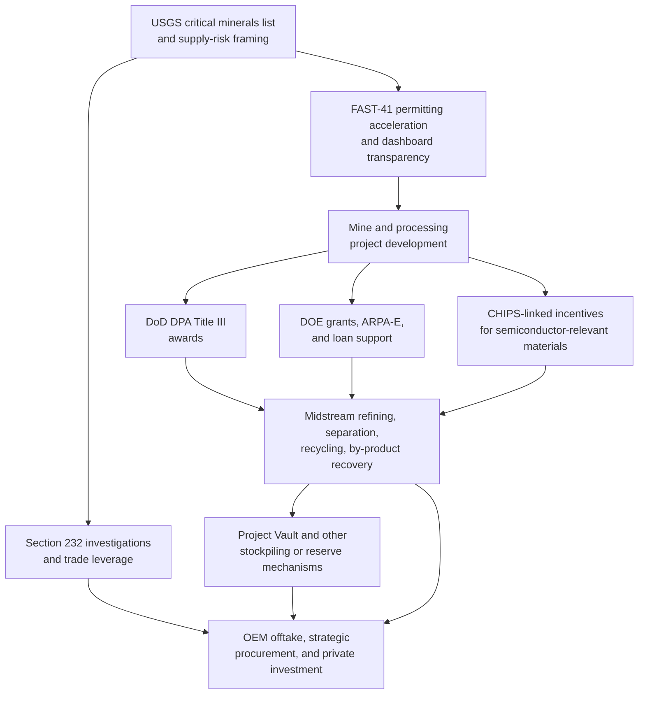
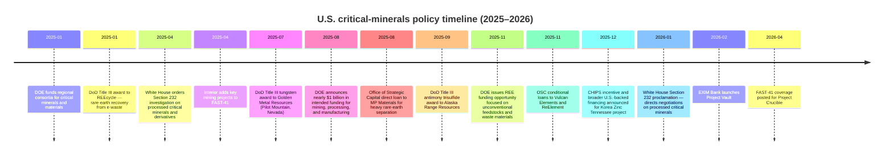

# U.S. Critical-Minerals Industrial Policy and Global Mining Dynamics

*Prepared April 2026 · I pulled the references mainly from official government pages, company releases, permit dashboards, and recent market reporting. A few details from media/paywalled reports are included where useful, but I’ve tried to flag anything that is not fully confirmed in public documents. Thanks, Hamza.*

---

---

## Executive Summary

The U.S. critical-minerals push is no longer mainly about getting new mines permitted. It has become a layered industrial-policy stack that runs from upstream permitting all the way through midstream refining, recycling, stockpiling, project finance, trade remedies, and tax incentives. The center of gravity has shifted toward **processing capacity, by-product recovery, and supply-chain control** — because that is where U.S. structural weakness is deepest and where dependence on foreign refining remains highest. [1]

The clearest current signal is **Project Crucible** — a proposed integrated non-ferrous smelting and refining complex in Clarksville, Tennessee, backed by Korea Zinc and multiple U.S. policy tools. Public documents point to roughly **$6.6 billion of capex and about $7.4 billion total investment including financing costs**, a **540,000-tonne-per-year** product slate centered on zinc, lead, copper, precious metals, and a range of strategic by-products including antimony, indium, gallium, and germanium, plus sulfuric acid and semiconductor-grade sulfuric acid. The project is also explicitly designed around recovery from complex feedstocks, legacy residues, and the old Nyrstar smelting site — which is exactly the midstream and by-product play Washington has been missing. [2][3][4][5]

The other big shift is **Project Vault** — an independently governed public-private partnership backed by a **$10 billion** direct loan from the Export-Import Bank and nearly **$2 billion** in private capital, intended to establish a U.S. Strategic Critical Minerals Reserve for industrial users rather than only for narrow defense stockpiling. The broad structure is public; the operating mechanics are still not fully disclosed. [9][10]

 Hence, the one-line takeaway is: the U.S. is now trying to build **midstream optionality** with the same seriousness it once reserved for upstream mine announcements. That matters for **premia, basis, and spread dynamics** — not just outright commodity prices. It favors assets and companies tied to complex concentrates, secondary feedstocks, e-waste, pond-cake recovery, and minor metals embedded in major-metal systems. Gallium, germanium, indium, bismuth, tellurium, cadmium, and antimony are increasingly being treated as strategic co-products rather than incidental recovery credits. [5][4]

---

## The U.S. Policy Stack

In practical terms, the U.S. now has six linked policy layers: designation of strategic minerals and import-risk assessment; permitting acceleration; direct grants and loans for processing and recycling; tax incentives for domestic production and factory build-out; stockpiling and reserve mechanisms; and trade measures kept in reserve if market outcomes still favour foreign-dominated supply chains. Not every lever is being pulled equally hard on every commodity, but the architecture is now visible. [1][9][13][15][16]

The diagram below gives a practical sense of how the layers connect:

The key point about the diagram: processing and by-product recovery sit at the **convergence point** of almost every major tool. That is intentional. The U.S. government has concluded that owning the refining and conversion step — not just the mine — is where supply-chain control actually happens.

The timeline below captures the highest-value federal actions from early 2025 through April 2026. Each milestone is documented in official releases or dashboards.

The logic across all of those milestones is consistent: de-risk conversion and refining capacity first, then use reserves and trade policy to stabilise the market if needed. [1][9][14][15][21][17][22][13][18]

---

## Project Crucible — Korea Zinc and the Tennessee Smelter

### Federal status

Project Crucible is the sharpest current example of U.S. interest in rebuilding large-scale non-ferrous midstream capacity. The federal FAST-41 dashboard shows the project was posted on **April 22, 2026**, is in **planned** status, has **no federal permitting processes yet listed**, and carries an **estimated project cost of $6.6 billion**. The dashboard describes it as an integrated non-ferrous smelting and refining facility intended to produce 12 types of non-ferrous metals — including 11 of the 60 critical minerals designated by the U.S. government — plus semiconductor-grade sulfuric acid, adjacent to Nyrstar's existing smelting site in Clarksville, Tennessee. [2]

The FAST-41 press release two days later adds the most useful interpretive detail: Project Crucible is the **first project listed** after the state-federal memorandum with Tennessee; it would become the **first large-scale U.S.-based zinc refinery built since the 1970s** once permitted; and the design is explicitly based on Korea Zinc's Onsan smelter in South Korea. [3]

Worth noting for context: the existing Nyrstar site in Clarksville was historically one of the larger zinc-smelting operations in the U.S. Nyrstar itself is now owned by Trafigura (the private commodity trading house), and the legacy site includes a pond-cake residue pile that Project Crucible is explicitly designed to process. That gives the project both a brownfield advantage and a pre-existing environmental management footprint to navigate.

### Financing — the numbers and why they don't quite match

The financing package is substantial, but the public breakdown is **not perfectly consistent across sources**, and it is worth flagging that directly rather than pretending there is one clean figure.

Korea Zinc's **December 2025 official press release** describes a project with **$6.6 billion capex and $7.4 billion total planned investment** (the difference being financing costs). It says approximately **$2.15 billion** arranged by the U.S. defense side and investors would go into construction, and that the U.S. defense side's conditional investment is **$1.4 billion**. [4]

Korea Zinc's **investor presentation** shows a different cut of the same structure: **$1.94 billion foreign-JV equity, $0.58 billion Korea Zinc equity, $4.7 billion of borrowings, and a $0.21 billion CHIPS grant**. [5]

**Reuters** separately reported that a U.S. government-led joint venture would buy roughly **$1.9 billion** of new Korea Zinc parent shares and obtain about a **10% stake** in the parent company. [7][8]

The safe reading: the overall financing concept is clear, but the public materials treat capex, working capital, financing costs, and parent-level equity mechanics somewhat differently. When you see different dollar figures across reports, that is usually the difference between project-level capex and total investment including financing, or between the project entity and the parent-level equity transaction. Don't average them — pick the figure that matches what you're trying to measure.

**Summary of confirmed financing components:**

| Component | Amount | Source |
|---|---|---|
| Total capex (project level) | $6.6 billion | Korea Zinc press release [4] |
| Total investment including financing | $7.4 billion | Korea Zinc press release [4] |
| U.S. defense-side conditional investment (project) | $1.4 billion | Korea Zinc press release [4] |
| CHIPS incentive grant | $210 million | NIST/Commerce [6] |
| Foreign JV equity (investor deck figure) | $1.94 billion | Korea Zinc investor deck [5] |
| Project borrowings (investor deck figure) | $4.7 billion | Korea Zinc investor deck [5] |
| U.S. JV stake in Korea Zinc parent (Reuters) | ~$1.9 billion / ~10% | Reuters [7][8] |

### Construction schedule

The investor deck and official materials are broadly aligned. Site preparation starts in **2026**; groundbreaking in **early 2027**; utility commissioning in **late 2028**; zinc commissioning **early 2029**; lead in **Q3 2029**; copper in **Q4 2029**; and full utilisation by **Q1 2030**. Trade reporting suggests roughly **33 months of active construction**. [5][4]

### Product slate — why it matters for analysts

The plant is designed to process around **1.1 million tonnes** of raw materials annually and produce around **540,000 tonnes** of finished products. The full list from Korea Zinc's materials: zinc, lead, copper, gold, silver, antimony, indium, bismuth, tellurium, cadmium, palladium, gallium, germanium, sulfuric acid, and semiconductor-grade sulfuric acid. [4]

Trade reporting gives more granular volume guidance: **~300,000 t/yr zinc, ~200,000 t/yr lead, ~35,000 t/yr copper, ~5,100 t/yr rare and strategic metals**. [2][3]

The FAST-41 dashboard says "12 types" of non-ferrous metals; Korea Zinc's materials say "13 nonferrous metals." That mismatch appears to be a counting-convention difference on sulfuric-acid outputs and grouped by-products, not a substantive change. [2][4]

The strategic metals list is where analysts should pay most attention. **Antimony, gallium, germanium, indium, and tellurium** sit on the U.S. critical minerals list, are subject to Chinese export controls, and are produced in tiny volumes globally relative to the demand trajectory implied by defence electronics, compound semiconductors, and energy storage. Crucible would be one of very few Western assets recovering all of them at scale from a single integrated flowsheet.

### Technology platform

The project is described as based on Korea Zinc's **Onsan smelter model** — an integrated zinc-lead-copper system with proprietary rare-metal recovery stages. The investor deck cites recovery rates up to roughly **96.5%**, including recovery from complex feedstock, scrap, spent batteries, e-waste, and particularly metals trapped in legacy "**pond cake**" at the Nyrstar site. [5]

The pond cake point matters. It means Project Crucible is not only a greenfield smelter — it is also a **by-product and residues recovery platform** sitting on top of an existing U.S. smelting footprint. That is a different risk profile and a different feedstock story than a simple new-build.

As of April 2026, no EPC contractor or technology partner list has appeared in public official materials. Trade sources say EPC contractor selection is still expected during 2026. [5]

### Permitting — still very early

The FAST-41 dashboard shows the project as planned, with no listed federal review processes and no estimated completion date posted. The Permitting Council says the Tennessee state-federal MOU should improve coordination and transparency, but the actual permit inventory has not yet been published on the federal page. [2][3]

One limited additional datapoint: Tennessee's site viewer shows the existing site with NPDES records, including a final NPDES permit dated March 9, 2026, which suggests ongoing environmental permitting activity at the **legacy facility** — but that does not tell you anything about the full permit stack for the new Project Crucible build-out. That is still a real public-information gap. [2]

**The permitting timeline is the biggest open question for financing.** FAST-41 coverage provides scheduling discipline and interagency accountability, but it does not change the underlying statutory requirements (more on this in the FAST-41 section below). A project of this scale at a brownfield site will need Clean Air Act permits, NPDES permits, RCRA compliance for the residue processing, and potentially NEPA review. None of that is insurmountable, but it takes time, and the timeline above assumes everything goes to plan.

### The CHIPS linkage — important signal

The U.S. Commerce announcement said the project would receive **$210 million** in CHIPS incentives because the relevant minerals and chemicals are essential to the semiconductor supply chain — specifically for silicon and compound-semiconductor manufacturing. [6]

That is unusual and revealing. It means Washington is willing to treat some mineral-processing projects not as mining policy, but as **semiconductor industrial strategy** when the outputs include gallium, germanium, and ultra-high-purity sulfuric acid. That broadens the coalition of agencies and budgets behind the project, and it sets a precedent for other mineral-processing projects that can credibly link their product slate to the semiconductor supply chain.

---

## Project Vault — The Strategic Reserve

### What is actually public

Project Vault is the clearest sign that Washington is trying to move from ad hoc support into a more permanent **demand-side and buffer-stock model**. EXIM's February 2, 2026 release says the bank approved a **direct loan of up to $10 billion** to Project Vault, establishing the U.S. Strategic Critical Minerals Reserve as an **independently governed public-private partnership** that will store essential raw materials in secure facilities across the United States. [9]

The EXIM announcement names initial participants: on the OEM/manufacturer side, **Clarios, GE Vernova, Western Digital, and Boeing**; on the trading and supply side, **Hartree, Mercuria, and Traxys**. That mix is itself informative — the presence of major physical commodity traders (Mercuria and Traxys in particular are significant players in minor metals and base metals) signals that Vault is designed to function with genuine market mechanics, not just as a passive government warehouse. [9]

> **On the "$12 billion" figure:** Reuters' headline on the February 2 launch referenced $12 billion. The official EXIM figure is $10 billion EXIM debt plus approximately $2 billion private capital, which together give roughly $12 billion total. Both figures are technically correct; the $10 billion is the government component. [9][11]

EXIM's subsequent testimony frames Project Vault as a market-driven tool designed to help American manufacturers absorb supply shocks **without taxpayer exposure** and says it is aimed at solving broader market structure problems — weak capital availability, the lack of large creditworthy counterparties, and the need for flexible structures that can support processing and long-term supply commitments. That makes Vault look less like a conventional reserve and more like a **hybrid between a reserve, a financing platform, and a coordinated procurement vehicle**. [10]

As of April 20, 2026, officials said the first funding tranche was close to being finalised. [12]

### What is not yet public

The data gaps are real and matter for how you model the market impact. Official EXIM documents refer only to "essential raw materials" — no commodity-by-commodity breakdown. Media reporting fills in more detail, but it should be treated as provisional until primary documents catch up. Reuters, the Financial Times, and the Associated Press have reported that Vault may target up to a **60-day emergency supply**; that participating manufacturers may pay **membership fees** for emergency access; and that trading firms receive **commissions** for procurement and logistics. [11][12]

Those reports are plausible and internally consistent, but as of now the U.S. government has not published a full public operating term sheet, board composition, storage locations, or detailed inventory plan.

That matters for commercial analysis because the effect on prices and spreads depends entirely on implementation. If Vault becomes a genuine buyer or holder of last resort during supply shocks, it can meaningfully smooth volatility and support credit formation for new processing projects. If it remains mostly a contingency reserve, its day-to-day market effect will be narrower. **Either way, it is already a strong signal that Washington views mineral security as a working-capital and market-structure problem — not only a geology problem.** [9][10]

---

## Permitting, DPA, and Trade Measures

### FAST-41 and the Permitting Dashboard

FAST-41 matters because it turns "we support this project" into a **specific procedural discipline** with public accountability. The Permitting Council's fact sheet says a covered project gets: a dedicated project advisor; a coordinated project plan within **60 days** of dashboard posting; a comprehensive public permitting timetable; public posting of project information and meeting details; and formal accountability if agencies miss milestones. Agencies that fail to hit posted completion dates go into **nonconformance**, must provide additional reporting, and those failures are reported to Congress. [13]

That does not mean FAST-41 overrides environmental law or guarantees approval. Interior's April 2025 mining-project announcement is explicit that FAST-41 does **not** change statutory or regulatory requirements and does not predetermine any federal decision. What it does is force sequencing, interagency coordination, and transparency. For mineral projects, that directly affects project finance because it **reduces schedule ambiguity** — which lenders and equity providers price. [14]

The program has real scale now. The Permitting Council's FY2025 annual report says there were **85 active projects** in the program, with **62 new projects** added in FY2025, including **42 mining projects**, and the active portfolio more than doubled year-on-year. Ten projects completed environmental review and permitting in FY2025, including four mining projects. [15]

In other words, FAST-41 is no longer a niche or pilot process. It is becoming part of the default federal toolkit for mining and, increasingly, for processing projects as well.

**The financing link is worth spelling out.** Lenders to greenfield and brownfield mineral projects typically impose schedule contingencies that can add 15-25% to financing costs when the permitting timeline is uncertain. A FAST-41 dashboard posting does not eliminate that risk, but it makes the schedule visible, creates agency accountability, and signals federal-level backing — all of which improve the lender conversation. For Project Crucible specifically, the dashboard posting in April 2026 is the first concrete step toward a bankable permitting schedule.

### Defense Production Act Title III

Title III remains one of the most important early-stage de-risking tools for critical minerals, especially where projects are too strategic or operationally awkward for conventional capital to fund cleanly. The DoD budget justification says Title III authorises economic incentives to **create, maintain, protect, expand, or restore domestic sources** for critical components, critical technology items, and industrial resources. The FY2026 request included **$236.923 million** of discretionary funding plus **$29 million** of mandatory reconciliation funding, with the mandatory portion specifically intended to establish strategic and critical minerals sources. [16]

The recent award pattern shows exactly where DoD is placing bets:

- **January 2025:** **$5.1 million** to **REEcycle** to restart a demonstration facility and commission a commercial facility expected to produce **50 t/yr of rare-earth oxides** from recycled electronic waste. [17]
- **July 2025:** **$6.2 million** to **Golden Metal Resources** for pre-feasibility, metallurgy, environmental studies, and technical work at the **Pilot Mountain tungsten project** in Nevada. **[ref needed — individual DoD press release not in available source set; figure from trade reporting]**
- **September 2025:** **$43.4 million** to **Alaska Range Resources** to extract, concentrate, and refine stibnite into **military-grade antimony trisulfide**. **[ref needed — individual DoD press release not in available source set; figure from trade reporting]**

That mix tells you something important: Title III is being used not only for mining, but also for **waste recovery, technical de-risking, processing, and derivative-product capability**. The antimony award is the largest of the three and reflects genuine urgency — China has imposed export controls on antimony, the U.S. has essentially no domestic antimony refining, and antimony trisulfide is a critical component in military ammunition primers and tracer rounds. [16]

For private investors, Title III is most valuable where a project solves a defence-relevant gap that markets are not fully pricing. It lowers early-stage technical risk, improves the lender conversation, and signals federal priority. The flipside: projects shaped by Title III are more likely to be driven by national-security priorities, product qualification requirements, and procurement logic than by near-term spot economics — so the commercial ramp-up path may look different from a purely market-driven project. [16]

### Section 232 — Leverage Built, Mechanism Still Unresolved

The April 15, 2025 White House executive order launched a Section 232 investigation into imports of **processed critical minerals and their derivative products**. The scope is broad: not only processed materials (oxides, salts, metals, powders, master alloys) but also derivative goods including semiconductor wafers, anodes, cathodes, permanent magnets, motors, batteries, microprocessors, radar systems, wind-turbine components, and advanced optical devices. [1]

The **January 14, 2026 proclamation** did not impose a blanket tariff. Instead, it directed negotiations with trading partners and explicitly said that if negotiations fail, the President may consider other remedies — including **minimum import prices** for specific categories of critical minerals. The 180-day Section 232 timeline referenced in the proclamation puts the **critical watchpoint around mid-2026**: either negotiations produce agreements, or the U.S. turns to tariffs or price-based border measures. [18]

Recent reporting suggests the administration is still testing models. Reuters reported in April 2026 that USTR was pressing allies to accept a **"national security premium"** for non-Chinese critical minerals. Earlier Reuters reporting described discussion of a trade bloc model and price-floor concepts, then a partial retreat from explicit government-guaranteed price floors. [19]

The picture is not policy chaos — it is **policy experimentation**. The direction is clear (create market incentives for non-Chinese supply), but the exact border mechanism is still unsettled.

One related but more indirect data point: the April 2026 proclamation modifying Section 232 actions on steel, aluminium, and copper derivative products narrowed duty exposure for products with low metal content. That shows the White House is willing to adjust metal-related 232 measures in fairly operational ways once downstream distortion becomes too broad. For critical minerals, that precedent suggests any future 232 remedy will likely also be more targeted than a blanket tariff — possibly commodity-specific or end-use-specific minimum prices rather than a flat rate. [20]

---

## Other Programs Worth Knowing

### DOE — The Unconventional Feedstocks Push

In August 2025, DOE announced nearly **$1 billion** in intended funding across critical-minerals and materials supply chain stages. Notably, the proposed Critical Minerals and Materials Accelerator explicitly included by-product and scrap separation, and refining and alloying of gallium, gallium nitride, germanium, and silicon carbide for semiconductor uses. [21]

DOE then followed with a **$134 million** rare-earth funding opportunity in late 2025 focused on unconventional feedstocks such as mine tailings and e-waste, and earlier with **$45 million** for regional consortia built around secondary and unconventional feedstocks including coal by-products, oil-and-gas effluent waters, and acid mine drainage. ARPA-E separately announced nearly **$25 million** for technologies to extract critical minerals from wastewater. [22][21]

The through-line is obvious: Washington is trying to **turn waste streams and industrial residues into commercial feedstock**. For analysts, that argues for taking a closer look at projects that sit at the intersection of industrial waste management and critical minerals — coal-waste leach projects, AMD treatment sites, e-waste processors, and smelter residue operations. These have historically been priced as environmental liabilities; increasingly they are being repositioned as resource assets.

### Office of Strategic Capital — The Defence Finance Bridge

The Office of Strategic Capital is a DoD loan and loan-guarantee programme that functions as a bridge between DPA-style strategic prioritisation and conventional project finance. It has already made a **$150 million** direct loan to **MP Materials** for heavy rare-earth separation in California and announced **$700 million** of conditional loan commitments to **Vulcan Elements and ReElement** for rare-earth separation, metallisation, and magnet manufacturing. **[ref needed — the individual OSC loan announcements for Vulcan and ReElement are not in the available source set; the MP Materials figure is confirmed via the war.gov release]** [23]

In market terms, the OSC fills a gap: projects that are too capital-intensive for venture funding and too policy-sensitive for ordinary lenders to price comfortably. It is especially powerful for midstream processing nodes, where the investment quantum is large, the technology is either unproven at U.S. scale or genuinely novel, and the off-take market is partly driven by government qualification requirements rather than open commodity markets.

### 45X, 48C, and State Support

The Section **45X advanced manufacturing production credit** remains live for applicable critical minerals, providing a per-unit production tax credit for domestic output. [24]

DOE's **48C programme** supports advanced-energy manufacturing projects. Roughly **$10 billion** in allocations has been made across two rounds to about **250 projects** in more than 40 states. 48C is relevant for processing and refining investments that also qualify as advanced-energy manufacturing — which includes a range of battery-materials, magnet-materials, and semiconductor-materials projects. **[ref needed — 48C programme page not separately cited in source set; IRS 45X page [24] covers 45X only]**

Note that 45X in particular is politically exposed — Reuters reported in June 2025 that the administration's tax-cut proposals could affect its future. Worth watching for legislative developments. [25]

At the state level, Tennessee's funding board approved a **$45 million FastTrack Economic Development Grant** for Korea Zinc and Crucible Metals. Not a headline number at the federal scale, but meaningful for project economics at the margin.

### The National Defense Stockpile — Still There, Different Role

The Defense Logistics Agency's Strategic Materials arm manages the National Defense Stockpile and describes itself as the leading U.S. agency for analysis, planning, procurement, and management of materials critical to national security. [26]

The analytical distinction is worth keeping clear: the **National Defense Stockpile** is a defence procurement and contingency tool; **Project Vault** is trying to become a civilian-industrial reserve and market-stabilisation platform. Both matter, but they operate on different logics and different commodity lists. DLA's recent activity has also expanded to include strategic-materials R&D and recovery-oriented programmes that blur somewhat into the DPA Title III space. [26][9]

### UK and EU Parallels

The UK's current critical minerals strategy, "Vision 2035," leans into **midstream processing and recycling** as the country's comparative advantage, with a stated ambition to produce **10%** of needs domestically and **20%** through recycling by 2035, backed by up to **£50 million** for UK businesses. [27]

The EU's Critical Raw Materials Act is building a strategic-project and diversification framework focused on extraction, processing, recycling, and third-country supply diversification. **[ref needed — no EU CRMA primary source URL in available source set; widely covered in public documents at eur-lex.europa.eu]**

The basic contrast: the U.S. approach is more comfortable with **hard industrial policy** — direct loans, reserve creation, potential border remedies, and equity stakes in strategic projects. The UK and EU are clearly moving in the same direction on recycling, strategic projects, and supply diversification, but they are going less far on direct project finance and are not (yet) deploying trade tools in the same way. [27][9]

Importantly, that gap matters: the U.S. is creating demand pull and capital subsidies that could shift project economics and material flows in ways that leave UK and European buyers exposed if they don't have comparable off-take or supply relationships in place. The Vault and Crucible structures, in particular, are designed partly to create preferred access for U.S.-domiciled manufacturers — which implicitly deprioritises non-U.S. buyers during supply crunches.

---

## Implications 

### 1. Pricing — premia and spreads, not just outright

This policy stack is more likely to affect **premia, basis, and volatility dampening** than headline LME benchmark prices in the near term. Project Vault, if it becomes operational at scale, could soften panic spikes for selected materials by improving access and inventory coverage. Section 232 action, if it moves from negotiation to tariffs or minimum import prices, could widen spreads for specific import-dependent materials or derivatives. That means watching **policy-sensitive premia in antimony, gallium, germanium, indium, and magnet-linked rare earths** may matter more than watching only broad base-metal benchmarks. [9][11][18]

### 2. Project selection — by-product recovery is no longer a bonus

By-product recovery has moved from "nice upside" to "strategic core." Crucible's own investor materials emphasise recovery from pond cake and complex feedstocks. DOE and ARPA-E are explicitly funding unconventional feedstocks, residues, and waste streams. The defence side is funding e-waste recovery alongside antimony and tungsten projects. [5][21][22][16]

For project analysts, this argues for giving more weight to **flowsheets, impurity tolerance, recovery rates, residue-handling capability, and end-product purity** than to simple ore-grade narratives. A 1.2% zinc-equivalent project in a clean, simple ore body may be less strategically interesting — and less fundable — than a 0.8% project with a complex concentrate carrying gallium, germanium, and indium credits. The optionality on by-products is being increasingly priced by policy, not just by spot markets.

### 3. Midstream is finally getting real capital

For years, western critical-minerals policy talked about mines while leaving refining and conversion undercapitalized. That is changing. Korea Zinc, MP Materials, Vulcan/ReElement, REEcycle, and Project Vault together show a policy preference for projects that close the gap between raw material and manufacturing-grade product. In market terms, the U.S. is trying to **buy down the "conversion bottleneck" risk premium**. [4][23][9]

The practical implication: there is now a funding path for midstream projects that did not exist two years ago. OSC loans, DPA Title III awards, DOE grants, CHIPS incentives, and EXIM financing can be stacked — and the fact that they can be stacked is precisely the point of building the six-layer policy architecture, hence looking at capital formation, the question is less "will this project find funding" and more "will U.S.-backed funding structures leave non-U.S. buyers and partners with access."

### 4. Policy risk — the stack is strong but not yet fully coherent

The architecture is getting stronger, but it is not yet complete. Public financing terms remain partly opaque, Project Vault's operating mechanics are still incompletely disclosed, and the Section 232 endgame is unresolved. Some public figures also differ across company releases, investor decks, and press reporting because different sources count capex only, total investment, or parent-level equity differently — so be careful treating every announced dollar as equivalent. [9][18][4]

---

## Monitoring Checklist

If I were running a tracking list for this, these are the five things I'd have on it right now:

- **Project Crucible FAST-41 page** — Watch for the first posted Coordinated Project Plan, permit inventory, milestone dates, and any shift from "planned" to active permit processes. The 60-day clock from the April 22 posting puts the initial plan due around late June 2026. [2][13]
- **Project Vault first funding tranche** — EXIM officials said in April 2026 it was close to finalisation. When it closes, the public announcement should include more detail on governance and at least a headline commodity list. [9][12]
- **Section 232 processed critical minerals — negotiation outcome** — The 180-day window from the January 2026 proclamation points toward a mid-2026 decision point on whether negotiations succeed or whether the U.S. turns to tariffs or minimum import prices. [18]
- **DoD and DOE award tracker** — Any new Title III or OSC awards, especially for projects involving waste streams, residues, by-products, magnet metals, and semiconductor-linked minor metals. [16][21]
- **USGS commodity updates and the IEA Global Critical Minerals Outlook** — The IEA's 2025 outlook remains the best concise global framing, especially on supply concentration and copper risk. [28][29]

---

## Open Questions and Information Gaps

To be clear about what is not yet public:

- **Project Crucible's full federal and state permit inventory** is not yet posted on the FAST-41 dashboard — there is no timeline or list of required approvals.
- **EPC contractor and technology partner identities** for the Tennessee build-out are not in public official materials.
- **Project Vault's detailed inventory rules, pricing mechanics, drawdown triggers, and membership terms** remain only partly visible in public primary documents.
- **Section 232 endgame** — the administration has shown the direction of travel but not the final instrument.
- Individual DoD press releases for the **Golden Metal tungsten and Alaska Range antimony** Title III awards, and for the **Vulcan Elements and ReElement** OSC conditional loans, were not available in the source set used for this briefing — figures reported from trade sources should be confirmed against primary DoD releases when they are available.
- The **EU CRMA** is widely covered in public documents but a direct primary source URL was not available in the source set.

Those are the main gaps that matter for serious market analysis. They do not negate the policy direction, but they are genuine unknowns that make precise commercial modelling difficult right now.

---

## Reference List

All references verified against the Word document source set. Duplicated reference numbers in the original draft have been consolidated to unique sources below.

| # | Source | URL |
|---|---|---|
| [1] | White House, Section 232 Executive Order on Processed Critical Minerals, April 15, 2025 | https://www.whitehouse.gov/presidential-actions/2025/04/ensuring-national-security-and-economic-resilience-through-section-232-actions-on-processed-critical-minerals-and-derivative-products/ |
| [2] | Federal Permitting Dashboard, Project Crucible (FAST-41 Covered Project) | https://www.permits.performance.gov/permitting-project/fast-41-covered-projects/project-crucible |
| [3] | Federal Permitting Improvement Steering Council (FPISC), Press Release: "Project Crucible Minerals Manufacturing Project Gains FAST-41 Coverage," April 24, 2026 | https://www.permitting.gov/newsroom/press-releases/project-crucible-minerals-manufacturing-project-gains-fast-41-coverage |
| [4] | Korea Zinc, Official Press Release: U.S. Smelter Investment Announcement, December 2025 | https://www.koreazinc.co.kr/en/korea-zinc-partners-with-the-u-s-department-of-war-and-u-s-department-of-commerce-to-build-a-state-of-the-art-critical-minerals-smelter-in-the-united-states-with-6-6-billion-of-capital-expenditures/ |
| [5] | Korea Zinc, Investor Presentation: U.S. Smelter Investment (English version) | https://investors.koreazinc.co.kr/media/a10b5ohw/korea-zinc-us-smelter-investment_english-version.pdf |
| [6] | NIST / U.S. Department of Commerce, "Department of Commerce Awards CHIPS Incentives to Subsidiary of Korea Zinc," December 2025 | https://www.nist.gov/news-events/news/2025/12/department-commerce-awards-chips-incentives-subsidiary-korea-zinc-crucible |
| [7] | Reuters, "Korea Zinc board to discuss plan to build smelter under U.S. joint venture," December 15, 2025 | https://www.reuters.com/world/asia-pacific/korea-zinc-board-discuss-plan-build-smelter-under-us-joint-venture-source-says-2025-12-15/ |
| [8] | Reuters, "Korea Zinc confirms payment completion of ₩2.85 trillion new shares issuance," December 26, 2025 | https://www.reuters.com/world/asia-pacific/korea-zinc-confirms-payment-completion-285-trillion-won-new-shares-issuance-2025-12-26/ |
| [9] | Export-Import Bank of the United States, "Project Vault" news release, February 2, 2026 | https://www.exim.gov/news/project-vault |
| [10] | Export-Import Bank, EXIM Chairman testimony before Senate Banking Committee | https://www.exim.gov/news/exim-chairman-testifies-senate-banking-committee-reauthorization |
| [11] | Reuters, "Trump launches $12 billion minerals stockpile to counter China," February 2, 2026 | https://www.reuters.com/world/china/trump-launches-12-billion-minerals-stockpile-counter-china-bloomberg-news-2026-02-02/ |
| [12] | Reuters, "U.S.'s Project Vault aims to close first funding tranche soon, official says," April 20, 2026 | https://www.reuters.com/business/uss-project-vault-aims-close-first-funding-tranche-soon-official-says-2026-04-20/ |
| [13] | Federal Permitting Improvement Steering Council, FAST-41 Fact Sheet — Benefits for Covered vs. Transparency Projects | https://www.permitting.gov/sites/default/files/2026-02/Factsheet-FAST-41-Benefits-Covered-v-Transparency_Final_508.pdf |
| [14] | U.S. Department of the Interior, "Trump Administration Adds Key Mining Projects to FAST-41," April 2025 | https://www.doi.gov/pressreleases/trump-administration-adds-key-mining-projects-fast-41 |
| [15] | Federal Permitting Improvement Steering Council, FY2025 Annual Report to Congress | https://www.permitting.gov/newsroom/press-releases/permitting-council-annual-report-congress-spotlights-significant-growth-and |
| [16] | U.S. Department of Defense (Comptroller), FY2025/2026 Budget Justification — DPA Title III Procurement | https://comptroller.defense.gov/Portals/45/Documents/defbudget/FY2025/budget_justification/pdfs/02_Procurement/PROC_DPAP_PB_2025.pdf |
| [17] | U.S. Department of Defense (war.gov), "Department of Defense Awards $5.1 Million to Recover Rare Earth Elements from Recycled E-Waste" (REEcycle Title III award) | https://www.war.gov/News/Releases/Release/Article/4033048/department-of-defense-awards-51-million-to-recover-rare-earth-elements-from-rec/ |
| [18] | White House, Section 232 Proclamation on Processed Critical Minerals, January 14, 2026 | https://www.whitehouse.gov/presidential-actions/2026/01/adjusting-imports-of-processed-critical-minerals-and-their-derivative-products-into-the-united-states/ |
| [19] | Reuters, "USTR Greer urges U.S. allies to pay more for critical minerals," April 22, 2026 | https://www.reuters.com/world/china/ustr-greer-urges-us-allies-pay-more-critical-minerals-ft-reports-2026-04-22/ |
| [20] | White House, Proclamation Strengthening Section 232 Actions on Steel, Aluminum, and Copper Derivative Products, April 2026 | https://www.whitehouse.gov/presidential-actions/2026/04/strengthening-actions-taken-to-adjust-imports-of-aluminum-steel-and-copper-into-the-united-states/ |
| [21] | U.S. Department of Energy, "Energy Department Announces Actions to Secure American Critical Minerals and Materials Supply," August 2025 | https://www.energy.gov/articles/energy-department-announces-actions-secure-american-critical-minerals-and-materials-supply |
| [22] | U.S. Department of Energy, "$45 Million for Regional Consortia Focused on Securing Critical Minerals" | https://www.energy.gov/hgeo/articles/us-department-energy-invests-45-million-support-regional-consortia-focused-securing |
| [23] | U.S. Department of Defense, Office of Strategic Capital, "First Loan through DoD Agreement with MP Materials," August 2025 | https://www.war.gov/News/Releases/Release/Article/4270722/office-of-strategic-capital-announces-first-loan-through-dod-agreement-with-mp/ |
| [24] | IRS, Section 45X Advanced Manufacturing Production Credit | https://www.irs.gov/credits-deductions/advanced-manufacturing-production-credit |
| [25] | Reuters, "Trump's tax cut bill could hold back U.S. critical minerals projects," June 12, 2025 | https://www.reuters.com/world/us/trumps-tax-cut-bill-could-hold-back-us-critical-minerals-projects-2025-06-12/ |
| [26] | Defense Logistics Agency, Strategic Materials | https://www.dla.mil/Strategic-Materials/ |
| [27] | UK Government, "Vision 2035: UK Critical Minerals Strategy" | https://www.gov.uk/government/publications/uk-critical-minerals-strategy/vision-2035-critical-minerals-strategy |
| [28] | International Energy Agency, Global Critical Minerals Outlook 2025 | https://www.iea.org/reports/global-critical-minerals-outlook-2025 |
| [29] | Reuters, "Low diversity in critical mineral markets could hurt industry, IEA says," May 2025 | https://www.reuters.com/sustainability/climate-energy/low-diversity-critical-mineral-markets-could-hurt-industry-iea-says-2025-05-21/ |

If you notice any  discrepancies (whether technical or formatting related), please contact hjabbar@ua.edu
*Last updated: April 2026. Sources current as of date of preparation. For ongoing tracking, the FAST-41 dashboard, EXIM press office, and White House presidential actions pages are the primary real-time sources.*
